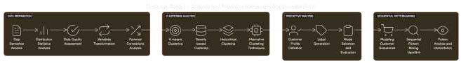
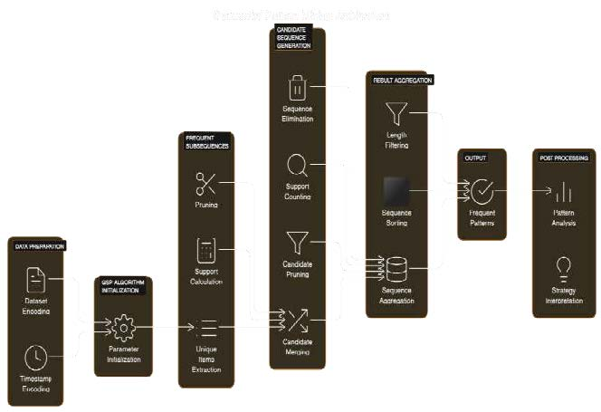
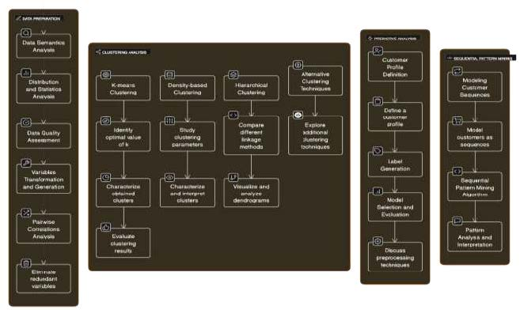

# Customer Behaviour Analysis and Predictive Modelling in Supermarket Retail: A Comprehensive Data Mining Approach (CBA-PD)

This project was developed during the Data Mining course at the [Department of Computer Science](https://chennai.vit.ac.in/) at [Vellore Institute of Technology](https://chennai.vit.ac.in/) under the supervision of Dr. Kavitha Dhanushkodi

## Table of Contents
- [Introduction](#introduction)
- [Tasks](#tasks)
  - [Task 1: Data Understanding and Preparation](#task-1-data-understanding-and-preparation)
  - [Task 2: Descriptive Analysis](#task-2-descriptive-analysis)
  - [Task 3: Predictive Analysis](#task-3-predictive-analysis)
  - [Task 4: Sequential Pattern Mining](#task-4-sequential-pattern-mining)
- [Dataset](#dataset)
- [Publication](#publication)

## Introduction
The project consists of data analysis using data mining tools to understand and predict customer behavior in supermarket retail. It includes tasks such as data understanding, preparation, clustering, predictive analysis, and sequential pattern mining.

## Tasks

### Task 1: Data Understanding and Preparation
- **Data Understanding**: Explore the dataset, assess data quality, distribution of variables, and pairwise correlations.
- **Data Preparation**: Improve data quality and prepare it by extracting new features for customer profiling and purchasing behavior.

### Task 2: Descriptive Analysis
Perform clustering analysis to identify customer segments based on their purchasing behavior.

### Task 3: Predictive Analysis
Predict whether a customer is a high-spending, medium-spending, or low-spending customer using various predictive models.

### Task 4: Sequential Pattern Mining
Mine frequent sequential patterns to model customer purchasing behavior over time.

## Dataset
The dataset includes customer purchasing data. Detailed information about the dataset can be found in the `dataset` folder.

## Publication
This project has been published in the IEEE. You can find the full publication here:
- **Customer Behaviour Analysis and Predictive Modelling in Supermarket Retail: A Comprehensive Data Mining Approach**
- [IEEE Xplore Digital Library](https://ieeexplore.ieee.org/document/10542125)

## License
This project is licensed under the terms of the LICENSE file.

